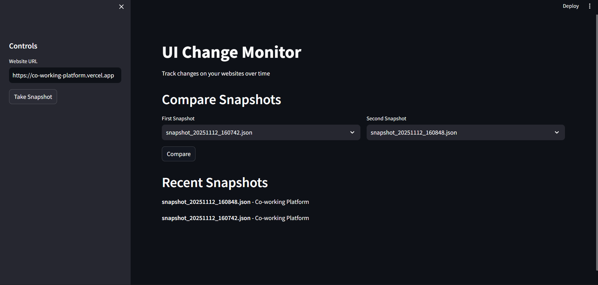

# UI Change Monitor

A powerful Selenium-based tool that automatically tracks and detects visual changes on websites over time. Perfect for monitoring UI updates, content changes, and website evolution.


## Features

- **🔍 Automated Website Monitoring** - Track any website for visual and content changes
- **Smart Change Detection** - Detect added/removed elements, text changes, and visibility changes
- **Snapshot History** - Maintain complete history of website versions
- **Flexible Configuration** - Easy to customize what elements to monitor
- **Beautiful Interface** - Streamlit web app for easy interaction
- **Robust Scraping** - Handles JavaScript-heavy websites (React, Vue, Angular)

## DashBoard Snapshot



## 🛠️ Installation

### Prerequisites
- Python 3.8+
- Chrome or Firefox browser

### Quick Setup

1. **Clone the repository**
```bash
git clone https://github.com/yourusername/ui-change-monitor.git
cd ui-change-monitor
```

2. **Create virtual environment (recommended)**
```
python -m venv venv
source venv/bin/activate  # On Windows: venv\Scripts\activate
```

3. **Install dependencies**
```
pip install -r requirements.txt
```

4. **Run :**
```
streamlit run main.py
```
 Access the Dashboard

Open your browser and navigate to http://localhost:8501

Enter a website URL in the sidebar

Click Take Snapshot to capture the current UI

Take multiple snapshots over time

Select two snapshots to compare and view detailed change reports

### 📁 Project Structure
```
ui-change-monitor/
├── main.py               
├── browser_manager.py    
├── element_scraper.py     
├── snapshot_manager.py    
├── comparison_engine.py   
├── config.py           
├── requirements.txt    
└── snapshots/        
    ├── snapshot_20231112_143022.json
    └── snapshot_20231112_160848.json
```

#### Customize what elements to monitor in config.py:

DEFAULT_ELEMENTS = {
    "page_title": "title",
    "main_heading": "h1",
    "primary_button": "button, .btn",
    "navigation": "nav, .navbar",
    "main_content": "main, .content",
    "footer": "footer"
}

##### Edit config.py to add more CSS selectors

##### Extend comparison_engine.py to detect new types of changes